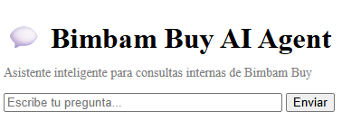

# 💬 Bimbam Buy AI Agent (RAG System)

Asistente inteligente basado en IA que responde preguntas utilizando documentos internos de la empresa Bimbam Buy.  
Este proyecto implementa un sistema RAG (Retrieval-Augmented Generation) combinando búsqueda semántica con un modelo LLM local.

---

## 🎥 Demo en funcionamiento

👉 https://drive.google.com/file/d/1mfXP6inQPzfcls1KfquPPcjMPoDu89gf/view?usp=sharing&t=16.497

🌐 Aplicación desplegada en OCI:
👉 http://129.80.234.155:8000/chat

---

## 🚀 Características
- Consulta documentos PDF empresariales
- Respuestas basadas en información real
- Interfaz web tipo chat
- Sistema RAG completo
- Modelo local con Ollama (Mistral)
- Sin dependencia de APIs externas

---

## 🧠 Arquitectura

Flujo del sistema:

PDF → carga → fragmentación → embeddings → FAISS (faiss_index) → retrieval → LLM (Ollama - Mistral) → respuesta

Tecnologías:
- Python
- FastAPI
- LangChain
- FAISS
- Ollama (mistral + nomic-embed-text)
- HTML + JavaScript

---

## ⚙️ Instalación local

### 1. Clonar repositorio

```
git clone https://github.com/danielc149/bimbam-buy-ai-agent.git
cd bimbam-buy-ai-agent
```

### 2. Crear entorno virtual

```
python -m venv venv
source venv/Scripts/activate
```

### 3. Instalar dependencias

```
pip install -r requirements.txt
```

### 4. Instalar Ollama

👉 https://ollama.com

### 5. Descargar modelos

```
ollama pull mistral
ollama pull nomic-embed-text
```

### 6. Generar o usar FAISS (faiss_index)

La primera vez que ejecutes el proyecto se generará automáticamente el índice FAISS a partir de los documentos.

Alternativamente, puedes incluir la carpeta `faiss_index/` en el repositorio (recomendado) para evitar regenerar embeddings.

### 7. Ejecutar aplicación

```
uvicorn app:app --host 0.0.0.0 --port 8000
```

### 8. Abrir en navegador

👉 http://127.0.0.1:8000/chat

---

## ☁️ Deploy en OCI (Paso a paso completo)

1. Crear cuenta en Oracle Cloud (Free Trial ~30 días)
2. Crear instancia Compute (recomendado: VM.Standard.E2.1 - 8GB RAM)
3. Conectarse por SSH
4. Instalar dependencias:

```
sudo dnf update -y
sudo dnf install git -y
```

5. Instalar Ollama:

```
curl -fsSL https://ollama.com/install.sh | sh
```

6. Clonar repositorio:

```
git clone https://github.com/danielc149/bimbam-buy-ai-agent.git
cd bimbam-buy-ai-agent
```

7. Crear entorno virtual:

```
python3 -m venv venv
source venv/bin/activate
pip install -r requirements.txt
```

8. Descargar modelos:

```
ollama pull mistral
ollama pull nomic-embed-text
```

9. Asegurar FAISS:

👉 Incluir carpeta `faiss_index/` en el repo para evitar recomputar embeddings

10. Abrir puerto 8000 en reglas de seguridad (OCI)

11. Ejecutar app:

```
uvicorn app:app --host 0.0.0.0 --port 8000
```

12. Acceder desde navegador:

👉 http://IP_PUBLICA:8000/chat

---

## 💬 Ejemplos de preguntas

👉 ¿Qué pasa si un pedido se retrasa?
👉 ¿Qué hacer si un pago fue rechazado?
👉 ¿En cuánto tiempo se hace un reembolso?
👉 ¿Qué cubre la garantía?

---

## ✅ Ejemplos de respuestas

**¿Qué cubre la garantía?**

Cubre fallas de fabricación, problemas de funcionamiento y defectos técnicos no causados por el usuario.

**¿Qué pasa si un pedido se retrasa?**

Se revisa el estado del envío con el operador y se identifican incidencias.

**¿En cuánto tiempo se hace un reembolso?**

Entre 5 y 10 días hábiles dependiendo del método de pago.

**¿Qué hacer si un pago fue rechazado?**

Verificar fondos, datos de tarjeta y autorización bancaria.

---

## ⚠️ Limitaciones

- Respuestas pueden tardar (30s–2min) en CPU sin GPU
- En Oci con la instancia escogida puede tardar de 2 a 4 minutos. 
- Depende de calidad de documentos
- El modelo puede generar respuestas aproximadas

---

## 🧠 Nota técnica

Este sistema ejecuta el modelo LLM localmente con Ollama, sin usar APIs externas como ChatGPT o Gemini. Esto aumenta la latencia pero garantiza independencia y control total del sistema.

---

## 🏁 Estado

✅ Proyecto funcional
✅ Deploy en OCI
✅ RAG implementado correctamente

---

## 👨‍💻 Autor

Daniel Cañete
